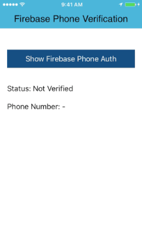

**<h1>Introduction</h1>**
INTUZ is presenting a custom Firebase Phone Authentication in iOS, just go through this tutorial and you will be able to integrate phone authentication in your application.

Please follow the below steps to integrate this control in your next project.

<br/><br/>
**<h1>Features</h1>**
* Ability to customize according to your requirement.
* Ability send or resend sms for verification code. If sms is not delivered on your device then you can perform skip.
* Easy to integrate.
* Fully customised design layout with theme support.

<br/><br/>



<br/><br/>
**<h1>Getting Started</h1>**

To use this component in your project you need to perform below steps:

1) Configure Google Firebase and Google Console Application to get API Key & Plist file from below URL.

> https://firebase.google.com/docs/auth/ios/phone-auth

2) Install below list of CocoaPods in your application.

```
  pod 'Firebase/Auth'
  pod 'SVProgressHUD'
```

3) Add ‘GoogleService-Info.plist’ in your project and you will get this file from Google Firebase Console.

<br/>
<p><b>Note:</b> If you not add ‘GoogleService-Info.plist’ file in your application then application will crash.</p>

4) Configure firebase in `didFinishLaunchingWithOptions` method.

```
// Configure Firebase
FirebaseApp.configure()
```

<br/>

5) Copy ‘MobileVerification’ folder and add it to your project and make sure you have checked “Copy if needed” option.

6) Import '#import "MobileVerification.h"' where you want to use. If you are using swift then import this file in Bridging-Header file.

7) Cnfigure Firebase Phone Verification theme.

```
// Set Firebase Auth Layout Theme.
let theme = MVTheme()
theme.backgroundColor = UIColor.white
theme.textColor = UIColor.black
theme.bodyFontName = "HelveticaNeue"

theme.topbarColor = UIColor.black
theme.topbarTextColor = UIColor.white
theme.titleFontName = "HelveticaNeue-Medium"

MobileVerification.shared().theme = theme
```

7) Implement Firebase Phone Verification from below code.

```
MobileVerification.verifyNumber("", title: "Firebase", withRootViewController: self) { (phoneNumber, error, isVerified) in
    if error == nil {
        print("Status: \(isVerified ? "Verified" : "Not Verified")\n\nPhone Number: \(phoneNumber ?? "-")")
    }
    else {
        print("Error: \(error?.localizedDescription ?? "-")")
    }
}
``` 

<br/><br/>
**<h1>Bugs and Feedback</h1>**
For bugs, questions and discussions please use the Github Issues.

<br/><br/>
**<h1>License</h1>**
The MIT License (MIT)
<br/><br/>
Copyright (c) 2018 INTUZ
<br/><br/>
Permission is hereby granted, free of charge, to any person obtaining a copy of this software and associated documentation files (the "Software"), to deal in the Software without restriction, including without limitation the rights to use, copy, modify, merge, publish, distribute, sublicense, and/or sell copies of the Software, and to permit persons to whom the Software is furnished to do so, subject to the following conditions: 
<br/><br/>
THE SOFTWARE IS PROVIDED "AS IS", WITHOUT WARRANTY OF ANY KIND, EXPRESS OR IMPLIED, INCLUDING BUT NOT LIMITED TO THE WARRANTIES OF MERCHANTABILITY, FITNESS FOR A PARTICULAR PURPOSE AND NONINFRINGEMENT. IN NO EVENT SHALL THE AUTHORS OR COPYRIGHT HOLDERS BE LIABLE FOR ANY CLAIM, DAMAGES OR OTHER LIABILITY, WHETHER IN AN ACTION OF CONTRACT, TORT OR OTHERWISE, ARISING FROM, OUT OF OR IN CONNECTION WITH THE SOFTWARE OR THE USE OR OTHER DEALINGS IN THE SOFTWARE.

<br/>
<br/>
**<h1></h1>**
<a href="https://www.intuz.com/" target="_blank"></a>


